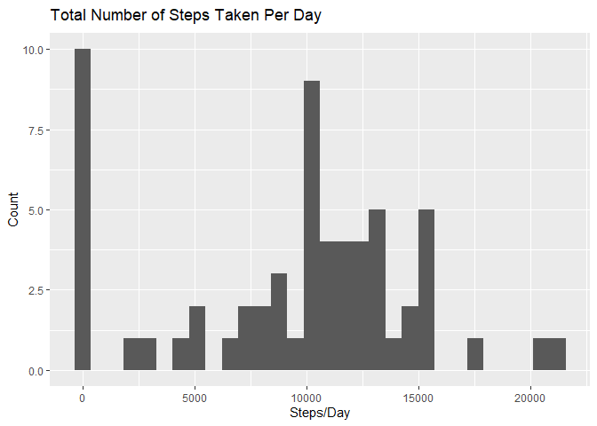
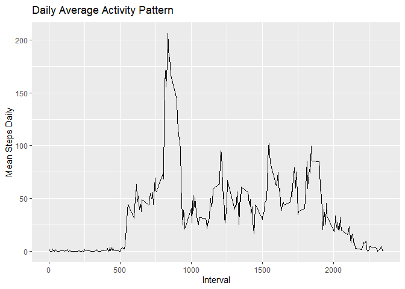
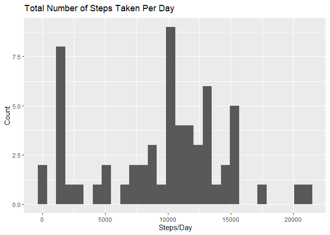
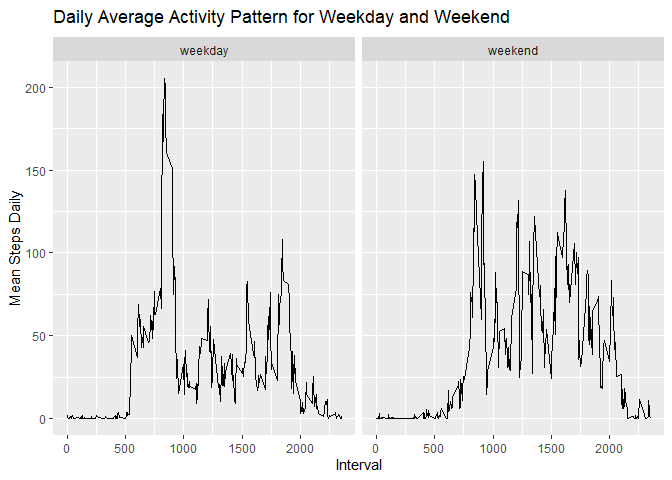

Week2
================
Muzi Li
12/19/2019

### Quantified Movement Activity Analysis

``` r
Data <- read.csv('activity.csv')
Data$date <- as.POSIXct(Data$date) 
library(ggplot2)
```

#### Mean Total Steps Per Day

``` r
Total_Data <- aggregate(x=list(Steps=Data$steps), by=list(Date=Data$date), FUN=sum, na.rm=TRUE)
ggplot(Total_Data, aes(x=Steps)) + geom_histogram() +
  xlab("Steps/Day") + ylab("Count") + 
  labs(title=expression("Total Number of Steps Taken Per Day"))
```

<!-- -->

``` r
mean <- mean(Total_Data$Steps)
median <- median(Total_Data$Steps)
```

The mean is 9354.2295082 and the median is
10395

### Mean Total Steps Per Interval

``` r
Interval_Data <- aggregate(x=list(Steps=Data$steps), by=list(Interval=Data$interval), FUN=mean, na.rm=TRUE)
ggplot(Interval_Data, aes(x=Interval, y=Steps)) + geom_line() +
  xlab("Interval") + ylab("Mean Steps Daily") + 
  labs(title=expression("Daily Average Activity Pattern"))
```

<!-- -->

``` r
max <- Interval_Data$Interval[Interval_Data$Steps == max(Interval_Data$Steps)]
```

##### Interval 835 contains the maximum number of steps on average across all days

### Impute Missing Values

The total missing value is 2304

``` r
library(simputation)
New_Data <- impute_median(Data, steps ~ interval)
```

``` r
Total_New_Data <- aggregate(x=list(Steps=New_Data$steps), by=list(Date=New_Data$date), FUN=sum)
ggplot(Total_New_Data, aes(x=Steps)) + geom_histogram() +
  xlab("Steps/Day") + ylab("Count") + 
  labs(title=expression("Total Number of Steps Taken Per Day"))
```

<!-- -->

The mean is 9503.8688525 and the median is
1.039510^{4}

### Panel plot comparing the average number of steps taken per 5-minute interval across weekdays and weekends

``` r
New_Data$week <- ifelse(weekdays(New_Data$date) == "Saturday" | weekdays(New_Data$date) == "Sunday" ,"weekend","weekday")
Interval_New_Data <- aggregate(x=list(Steps=New_Data$steps), by=list(Week=New_Data$week, Interval=New_Data$interval),
                           FUN=mean)
ggplot(Interval_New_Data, aes(x=Interval, y=Steps, fill=Week)) + 
  facet_grid( .~Week) +
  geom_line() +
  xlab("Interval") + ylab("Mean Steps Daily") + 
  labs(title=expression("Daily Average Activity Pattern for Weekday and Weekend"))
```

<!-- -->
